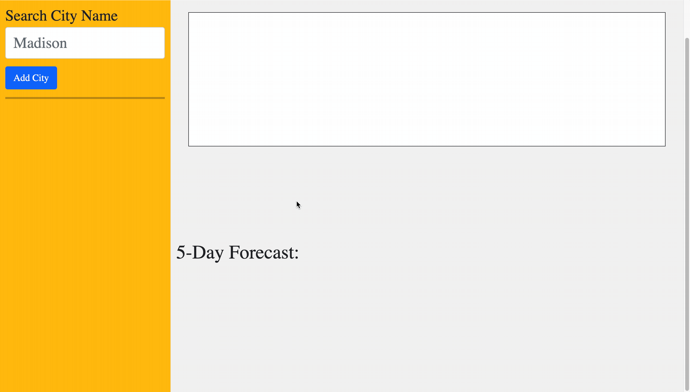

# Weather Dashboard

A weather Dashboard

## Visit the Site

[Cleck Here to Visit the Deployed Site](https://ohsweetwampum.github.io/weather-dashboard/)

## Description

This app displays the current day's weather as weel as the 5-day forecast for a particular city. You can search a city and the weather data will be displayed. Below the search box is an area for your recently searched citites so all you have to do is click on the city button and it's weather will be displayed. This app is quick to use and only gives essential up to date weather data.

## Technology Used

- OpenWeatherAPIs
  [Learn about OpenWeather](https://openweathermap.org/api)

- Bootstrap
  [Learn about Bootstrap](https://getbootstrap.com/)

- Day.js
  [Learn about Day.js](https://day.js.org/)

- jQuery
  [Learn about jQuery](https://jquery.com/)

- JavaScript
  [Learn about JavaScript](https://developer.mozilla.org/en-US/docs/Web/JavaScript)

- HTML
  [Learn about HTML](https://developer.mozilla.org/en-US/docs/Web/HTML)

- CSS
  [Learn about CSS](https://developer.mozilla.org/en-US/docs/Web/CSS)

- Git
  [Learn about Git](https://git-scm.com/)

## Usage

1. Enter a city in the search box, click "add city"
2. Weather data will then pop up
3. Your recently searched for cities will populate as buttons below the search box, you can click on these buttons to see the citie's weather data instead of searching again



## Code Highlight

I wanted to highlight this code snippet because I think it might be the first time I added html elements withing my JavaScript in this particular way and I just that it was neat.all the data (forecastDate, iconUrl, highTemp, lowTemp, wind speed and humidity) values are inserted using string concatenation.

```JavaScript
  var card = document.createElement("div");
      card.classList.add("col");
      card.innerHTML = '<div class="card border-dark bg-white"><div class="card-body">' +
        '<h5 class="card-title">' + forecastDate + '</h5>' +
        '' +
        '<p class="card-text">High: ' + highTemp + '°F</p>' +
        '<p class="card-text">Low: ' + lowTemp + '°F</p>' +
        '<p class="card-text">Wind: ' + forecastsForDate[0].wind.speed + ' mph</p>' +
        '<p class="card-text">Humidity: ' + forecastsForDate[0].main.humidity + '%</p>' +
        '</div></div>';
```

## Learning Points

- Furthered knowledge of local storage, saving and retrieving
- Learned how to use the spread operator
- learned how to utilize 3rd party APIs, calling, response, etc.
- Learned how add icons

## Author Info

Matthew Gibson

- [Portfolio](https://github.com/ohSweetWampum)
- [LinkedIn](https://www.linkedin.com/in/matthew-gibson-6b9b12237/)
- [Github](https://github.com/ohSweetWampum)

## Credits

[meyerweb.com](https://meyerweb.com/eric/tools/css/reset/)
(For my reset.css file)

[mdnwebdocs.org](https://developer.mozilla.org/en-US/docs/Web/JavaScript/Reference/Operators/Spread_syntax)
(spread operator)

[day.js.org](https://day.js.org/)
(Day.js documents)

[jQuery.com](https://jquery.com/)
(jQuery Documents)

[OpenWeatherMap.org](https://openweathermap.org/api)
(weather APIs)

## License

[](https://opensource.org/licenses/MIT)

---

```

```

Create a basic HTML layout using Bootstrap that includes a form with an input field for city name and a button to submit the form.

Add event listeners to the form and the button using JavaScript to handle user input and submission.

Use a third-party weather API, such as OpenWeatherMap, to retrieve the current weather data for the entered city. You can use the fetch() method to make a GET request to the API endpoint with the city name and API key as parameters.

Parse the JSON response from the API to extract the necessary information, such as the temperature, humidity, wind speed, and weather condition icon.

Display the current weather data on the webpage using JavaScript and dynamically created HTML elements.

Use the same API to retrieve the 5-day forecast for the entered city. You can make a similar GET request to a different API endpoint that provides the forecast data.

Parse the JSON response from the API to extract the necessary information for the forecast, such as the date, temperature, humidity, and weather condition icon.

Display the 5-day forecast data on the webpage using JavaScript and dynamically created HTML elements.

Add functionality to store the searched city in local storage and display it in a search history section on the webpage.

Add event listeners to the search history items to allow the user to click on them and retrieve the current and future weather data for that city.
